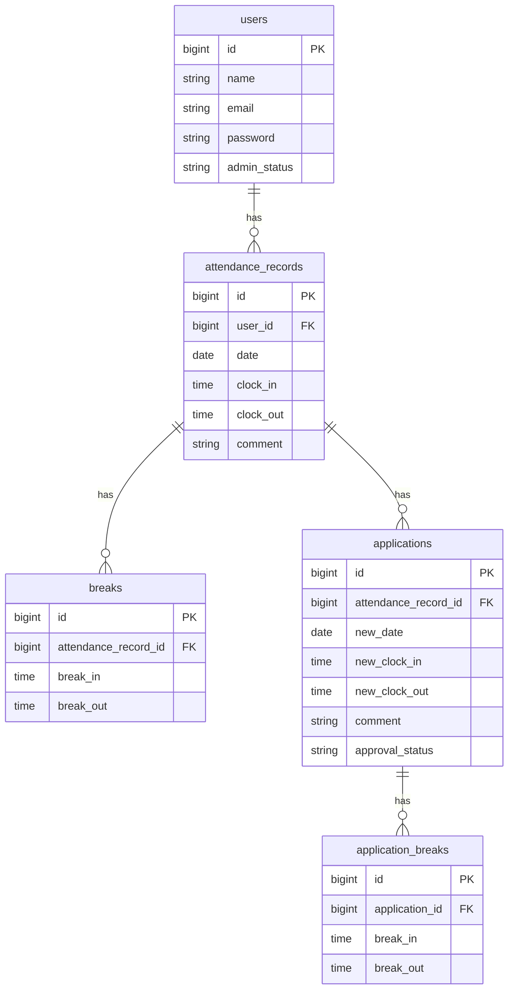

```mermaid
erDiagram

  users {
    bigint id PK
    string name
    string email
    string password
    string admin_status
  }

  attendance_records {
    bigint id PK
    bigint user_id FK
    date date
    time clock_in
    time clock_out
    string comment
  }

  breaks {
    bigint id PK
    bigint attendance_record_id FK
    time break_in
    time break_out
  }

  applications {
    bigint id PK
    bigint attendance_record_id FK
    date new_date
    time new_clock_in
    time new_clock_out
    string comment
    string approval_status
  }

  application_breaks {
    bigint id PK
    bigint application_id FK
    time break_in
    time break_out
  }


  users ||--o{ attendance_records :has

  attendance_records ||--o{ breaks : has

  attendance_records ||--o{ applications : has

  applications ||--o{ application_breaks : has

```
